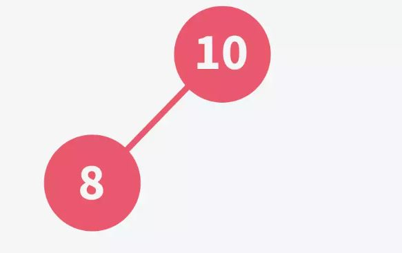

# Heap
## Complete Binary Tree Definition
- A binary tree is called complete binary tree when all the level of binary tree is completely filled except possibly the last level, which is always filled from left to right.
- Difference between a complete binary tree and a full binary tree is that, in a complete binary tree all leaf nodes should lean towards left and the last nodes need not to have a right sibling.

## Definition of Heap
According to Wikipedia, a Heap is a special type of binary tree. A heap is a binary tree that meets the following criteria:

- Is a complete binary tree;
- The value of each node must be no greater than (or no less than) the value of its child nodes.

A Heap has the following properties:
- Insertion of an element into the Heap has a time complexity of O(log N);
- Deletion of an element from the Heap has a time complexity of O(log N);
- The maximum/minimum value in the Heap can be obtained with O(1) time complexity

## Types of Heap
There are two kinds of heaps: **Max Heap** and **Min Heap**

**Max Heap:** Each node in the Heap has a value no less than its child nodes. Therefore, the top element (root node) has the largest value in the Heap.

**Min Heap:** Each node in the Heap has a value no larger than its child nodes. Therefore, the top element (root node) has the smallest value in the Heap.

  
   

## Insertion in Heap
Consider we have an array with elements 10, 8, 5, 15, 6 in it. To build a max-heap using the given elements, Follow the under-given steps –
- Add the first element, 10 in the tree. It is the root element in the tree.
  

    
     
  

- Add the next element in the tree. Compare it with the parent element. If it is greater than its parent element, swap their positions. It is done to ensure that the tree follows heap conditions, and a max-heap is maintained each time an element is added. Here, we should add the second element, 8 as the left child of the root element because a heap is filled from left to right. No swapping occurs here because 10 is greater than 8.
  

    
     
  

- Repeat the above-given step with the next element, 5.
  

    
     
  

- Add the next element, 15 in the tree. 
  

    
     
  

  Now since 15 is greater than its parent element 8, this tree is not a max-heap anymore. To make it a heap again, we will swap the positions of 8 and 15.
  

    
     
  

  
  Again the obtained tree is not a max-heap since 15 is greater than its parent element, 10. We will again swap the positions of 10 & 15. 
  

    
     
  

  
  This step is performed using recursion, and done until the inserted element finds its correct position in the heap.

  Notice that 15 was first added at the bottom of the tree and then moved up to its correct position. This moving up of elements is known as **bubbling up**.
  - Add the last element, 6 in the heap by comparing it with the parent.
    

      
       
    

    With this, we have added all the elements of the given array into a heap.

    One thing to note here is that a comparison is done each time an element is added. The number of comparisons also depends on the height of the tree. In the above case, a total of 5 comparisons were made. This results in a time complexity of **O(nlogn)** since the height of a binary tree is **logn**.

    But we can reduce the number of comparisons by using a method called **heapify** where elements are first added into the tree and then arranged in a bottom-up fashion. It helps in reducing the number of comparisons, and thus the time complexity of the overall algorithm.

    So, let us understand how to **heapify** a binary tree.

    ## How to Heapify a Binary Tree?
    **Heapify** is the process of rearranging the elements to form a tree that maintains the properties of the heap data structure.
  
    Recall the list/array that had the elements – 10, 8, 5, 15, 6 in it. To heapify these elements, and form a max-heap, let us follow the under-given steps –
  
    - Visualize all the elements of the list as a complete binary tree
  
      Treat the elements of the given array as the nodes of a tree. To visualize an array as a binary tree, refer to the part where we have discussed the array representation of the binary tree.
      

        
         
      

  
      Notice how the above-given binary tree is a complete binary tree but does not satisfy the properties of a max-heap since element 8 has an element greater than itself as its child.
  
    - Start from comparing the values of children nodes with that of the parent. If the value of the parent is smaller than the values of the children, swap it. Swapping is done with a larger of two children. This process is repeated until every node satisfy the properties of a max-heap –
  
      Here, we start comparing 8 with 15 and 6. Now, since 15 is greater than 8, we will swap their positions.

      

        
         
      

  
      Again, the property of max-heap is not satisfied since 15 is greater than 10. Therefore, we will once again perform the above step.
  
      Now that we have obtained a max-heap, we can stop this step.

      

        
         
      

  
      One interesting thing to note here is that a node can be heapified iff all the children nodes are already heapified. This is the reason why we start from the bottom-most sub-tree.
  
      This step is also performed using recursion. We create a function called heapify() that works by dividing the tree into smaller sub-trees and then comparing the values of parents with that of children in each sub-tree.
  
      Notice that the number of comparisons are reduced slightly. This way, we can significantly reduce the comparisons if there are many elements to be added.
  
      Here, the time complexity would be equal to the height of tree O(logn). This is because a node will be compared only to its parent, and thus, will be swapped at most O(logn) times.
    